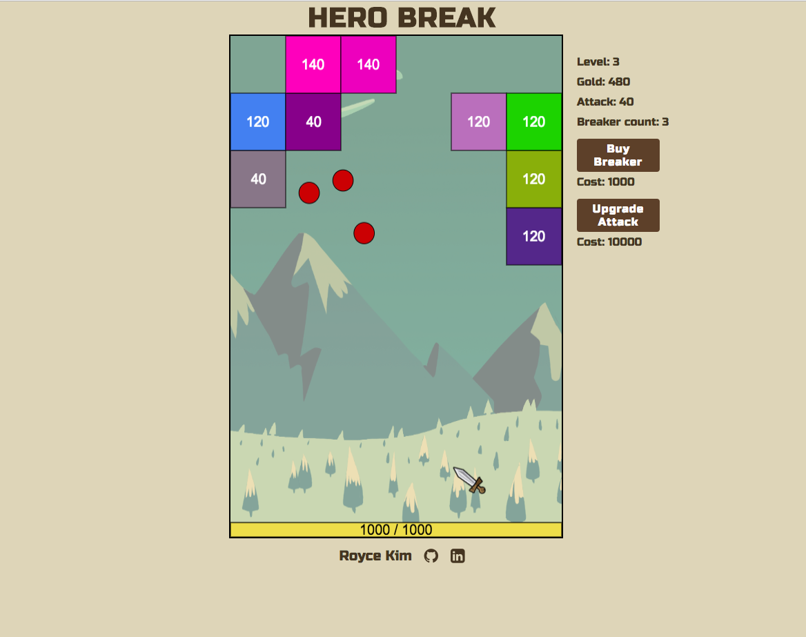

# Hero Break
[HeroBreak live](https://roycejh.github.io/herobreak/)

**Hero Break** is a browser game written in JavaScript and inspired by Brick Breaker. The aim is to reach and defeat the boss before the monsters deplete your health by reaching the bottom.




## Technologies
**Hero Break** is built using ES6 syntax JavaScript and HTML5 canvas for rendering elements onto the screen. At every set interval, the canvas is cleared of all elements on the screen and re-draws them based on their new coordinates.

## Implementation
### Classes
Each different object within the game have distinct classes to distinguish the different functionalities. Within the `game` class, all objects on the canvas are brought together and drawn from a single function call.

```JavaScript
draw(ctx) {
  ctx.clearRect(0, 0, this.DIM_X, this.DIM_Y);
  this.allObjects().forEach((obj) => {
    obj.draw(ctx);
  });
}
```

### Breakers
Breakers are accumulated by destroying special monsters. When the `runTurn` function is called, `setTimeout` is used to space out the interval of each breaker. The `direction` and `starting position` of the breaker is based on the properties of the `Pointer`.

```JavaScript
  runTurn() {
    Object.assign(this.currentAttackers, this.breakers);
    let vel = this.pointer.calculateDir();
    let startPos = this.pointer.position();
    let interval = 0;
    this.currentAttackers.forEach(breaker => {
      setTimeout(() => {
        breaker.assignDir(Object.assign([], vel));
        breaker.assignPos(Object.assign([], startPos));
      }, interval);
      interval += 200;
    });
  }
```

### Board
The `board` class keeps track of the number of `monster` objects. After each turn, a row of `monsters` is created on top pushing all the other monsters down a row. The number of `monster` in each row are randomly generated and the position of each monster is attributed based on a recursive call to the `spawn` function.

```JavaScript
spawn(num, pos, newRow) {
  if(num > 0) {
    if(Math.random() > .7) {
      let multiplier = this.assignMultiplier() || 2;
      let special = 0;
      if(Math.random() > .9) {
        special = 1;
      }
      newRow.push( new Monster(
        (100 + this.level * multiplier),
        Object.assign([],pos),
        special)
      );
    }
    pos[0] += Util.defaults.side;
    return this.spawn((num - 1), pos, newRow);
  }

  return newRow;
}
```
Each monster is given special traits such as giving the player more `breakers` on defeat or having an elite status, which increases the `monsters` `multiplier` on its health pool.

## To-Dos

### Reset breakers
A function to 'callback' breakers to end the round.

### Special breakers
Special breakers will have abilities that affect all the breakers, such as splash damage, which damages monsters in a wide area, pierce damage, which damages monsters in a row.

### Art
Each monster will have an image, and the game will have an overall medieval theme.
